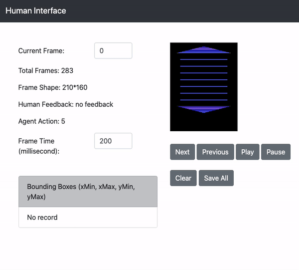

# Simple-Human-in-the-Loop-ML-Interface

## Description
A simple webpage-based human interface to facilitate human-in-the-loop machine learning research, which allows researchers to:

- remotely interact with (provide feedback) learning agent on server/clusters 
- easily and efficiently annotate images
- replay any trajectory with specific frame time
- easily customize the interface to meet their needs (the interface is implemented with basic python Flask, HTML and JavaScript) 




## Getting Started
- Run the app.py as normal Flask program
```
python app.py
```
- Go to [http://127.0.0.1:5000/](http://127.0.0.1:5000/)
- Control and provide feedback through keyboard or buttons
- Create bounding boxes by simple click-hold-drag-release

## Keyboard Input
You can define your own keyboard setting in function keyboardInputHandler in the file [templates/index.html](https://github.com/GuanSuns/Simple-Human-in-the-Loop-ML-Interface/blob/master/templates/index.html). Current setting is:

- A: positive feedback (+1)
- S: negative feedback (-1)
- D: no feedback (0)
- C: clear existing feedback
- \>: next frame
- <: previous frame
- P: auto play/stop auto play 


## Some Examples of Customizing the Interface
- Object Tracking: [object-tracking-example](https://github.com/GuanSuns/Simple-Human-in-the-Loop-ML-Interface/blob/master/examples/object_tracking)


## Reference
- Simple Image Annotator: [https://github.com/sgp715/simple_image_annotator](https://github.com/sgp715/simple_image_annotator)
- Widening the Pipeline in Human-Guided Reinforcement Learning with Explanation and Context-Aware Data Augmentation: [https://arxiv.org/abs/2006.14804](https://arxiv.org/abs/2006.14804)

